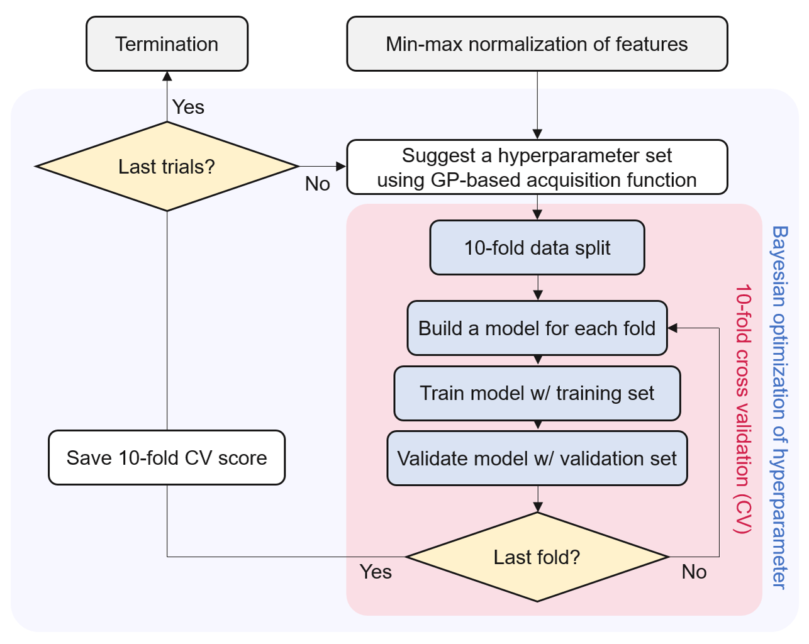

# SegrDNN
Codes for the paper entitled "Surface segregation machine-learned with inexpensive numerical fingerprint for the design of alloy catalysts" [*Mol. Catal.* **2023**, 541, 113096]. 

## Schematics

**Closed-loop hyper-parameter tuning of DNN model using Bayesian optimization (BO) and 10-fold CV:**

The flowchart above was re-designed based on the figure in the original paper [*Mol. Catal.* **2023**, 541, 113096]. 

## Included Codes

- `using_keras_tuner.py`: code for hyper-parameter tuning of DNN model for surface segregation energy (Esegr)
- `run.sh`: a shell script to prevent the python code from stopping

## Application of This Code

This code has been utilized in the following published paper:
1. D. Shin, G. Choi, C. Hong, and J. W. Han, *Mol. Catal.* 2023, 541, 113096 (https://doi.org/10.1016/j.mcat.2023.113096)
